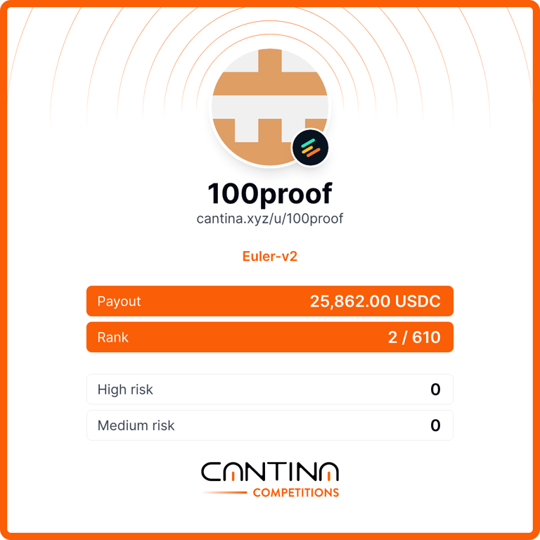

# Security Portfolio

This only covers the bounties, audits and audit competitions done under the 100proof handle.

----------------------------------------------------------------------------------------------------

## Blog

For write-ups and other security related posts see [100proof.org](https://100proof.org). I strive to maintain a very high standard in my written communication.

Apart from the bug bounty write-ups three posts I would recommend reading are:
- [An incredible opportunity to finally prove the value of formal methods](https://100proof.org/open-letter-on-fm.html)
- [A questionable design choice in Stacks/Clarity](https://100proof.org/a-questionable-design-choice.html)
- [Fixed point and real arithmetic are more different than you think](https://100proof.org/eighteen-decimals-not-approx-real-arith.html)

----------------------------------------------------------------------------------------------------

## Timeline

- **2022** Found first bounty in September 2022. 100proof came into being.
- **2023** Exclusively did bounty hunting and found KyberSwap bounty.
- **2024** Participated in one audit competition, Euler V2 on [Cantina](https://cantina.xyz) but otherwise bounty hunted. Morpho and NEAR bounties landed this year.
- **2025** Bounty hunted (without success) until September then performed 5 audits until end of year.

## Bounties

- **Sep 2022** [Notional](https://github.com/one-hundred-proof/notional-flash-attack).
- **Apr 2023** [KyberSwap](https://100proof.org/kyberswap-post-mortem.html).
- **Aug 2024** **Morpho**. Currently no write-up but credit is given here in the Morpho docs on [Security Considerations for Vault Curators](https://docs.morpho.org/curate/concepts/security-considerations/).
- **Nov 2024** [NEAR](https://100proof.org/near-total-network-shutdown.html) with [neumo](https://x.com/neumoxx).

----------------------------------------------------------------------------------------------------

## Audits

### Cyfrin

- **Oct 2025** [Remora Dynamic Tokens](./2025-10-22-cyfrin-remora-dynamic-tokens-v2.1.pdf)
- **Sep 2025** [Angstrom](./2025-10-01-cyfrin-sorella-l2-angstrom-v2.1.pdf)

### Greybeard Security

- **Oct 2025** [Bitflow HODLMM](./bitflow-HODLMM-2025-10.pdf)
- **Oct 2025** [Zest v2](./zest-v2-2025-10.pdf)
- **Nov 2025** [Hermetica hBTC](./hermetica-hbtc-2025-11.pdf)

----------------------------------------------------------------------------------------------------

## Audit competitions

- Euler v2 Competition. 2nd place. Team effort with **highbit**.

  
